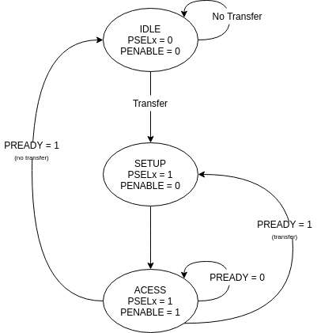

################
APB Interconnect
################

This interconnect supports the AMBA APB Protocol specification 2.0 (a.k.a APB4)
The interconnect is used to connect a single APB compliant master device to one or more APB
copmliant memory mapped slave devices.

In this chapter ``S`` would represent the number of slaves connected to the interconnect.

.. _apb_parameters:

Parameters
==========

Each instance of the interconnect consists of a single APB slave signals which should be connected
to either master-transactors or directly to a master interface and
vectored APB master signals which should be connected to either slave-transactors or
directly to a slave interface.

The interconnect interfaces are parameterized with the following parameters:

.. tabularcolumns:: |l|L|

.. _apb_crossbar_params:

.. table:: APB Interconnect Interface Parameters

  ==================  ===========
  Parameter Name      Description
  ------------------  -----------
  ``wd_addr``         size of the address fields in the read-address and write-address channels
  ``wd_data``         size of the data fields in the read-response and write-data channels
  ``wd_user``         size of the user fields in all the channels.
  ``tn_num_slaves``   indicates the number of slaves that will be connected to
                      this fabric.
  ==================  ===========

While the above parameters control the interface signals of the cross-bar, the
following need to be provided to the module instance to control the arbitration
and connection:

.. tabularcolumns:: |l|L|

.. table:: APB Interconnect Module Arguments

  ===================== =============================================================================
  Parameter Name        Description
  --------------------- -----------------------------------------------------------------------------
  ``fn_addr_map``       A function which provides a memory map of the address-space. It
                        takes an address as an argument and returns a one-hot `S` sized vector 
                        indicating which slave is selected for the transaction.
  ===================== =============================================================================

Theory of Operation
===================

The interconnect implementation is quite simple where, the address presented by the master is used
to identify which slave is selected and thus the respective PSEL line is asserted to initiate the
transaction. All other signals from the master are simply broad-cast to all the slaves. 

Within the vectored master interfaces, all the signals are replicated. The respones from the slave
devices is routed based on which slave's PSEL is asserted.

Transactors
-----------

The library provides two transctors: master transactor and slave transactor. The master transactor
has FIFO like interface on one side to receive request from the a master-device and generate the APB
master signals on the other side. The slave transactor on the other hand has APB slave interface on
one side to accept and respond to requests and a FIFO like interface on the other side to interact
with the slave devices.

The master transactor (connected to the master-device externally) can be in one of the three modes: 
IDLE, SETUP or ACCESS. On reset the transactor is in IDLE mode, willing to accept a new request 
from the master-device. :ref:`apb_master_states` shows the various modes of operation of the master
transactor amongst the mentioned modes.

.. _apb_master_states:

   Operating Modes of the master transactor

When a transfer is requested by the master-device, the transactor moves from IDLE mode to the SETUP
mode and selects the appropriate slave by setting the corresponding PSELx signal. The next clock
cycle, the transactor moves to the ACCESS mode, where PENABLE is asserted. The ACCESS mode is
completed only when the PREADY signal from the selected slave is high.
On completion of the ACCESS mode, if
a new pending transaction is detected from the master-device, then the transactor moves to SETUP
mode else goes back to the IDLE mode.

Using the Interconnect IP
=========================

The IP is designed in BSV and available at: https://gitlab.com/incoresemi/blocks/fabrics
The following steps demonstrate on how to configure and generate verilog RTL of
the cross-bar IP. 

.. note:: The user is expected to have the downloaded and installed 
  open-source bluespec compiler available at: https://github.com/BSVLang/Main

Configuration and Generation
----------------------------

1. **Setup**:

   The IP uses the python based `cogapp tool <https://nedbatchelder.com/code/cog/>`_ to generate bsv files with cofigured instances. 
   Steps to install the required tools to generate the configured IP in verilog RTL can be found 
   in `Appendix <appendix.html>`_. Python virtual environment needs to be activated before 
   proceeding to the following steps.

2. **Clone the repo**:

   .. code:: bash
   
      git clone https://gitlab.com/incoresemi/blocks/fabrics.git
      ./manager.sh update_deps
      cd apb/test

3. **Configure Design**: 
   
   The yaml file: ``apb_interconnect_config.yaml`` 
   is used for configuring the crossbar. Please refer to :numref:`apb_crossbar_params` 
   for information on the parameters used in the yaml file. 
   
   Address map should also be specified in this file using the slot-number 
   as the key of the dictionary. Following rules apply to the memory map:

     1. slot-numbering should be from 0 to ``tn_num_slaves - 1``
     2. Each slave can have one of the following access policies: ``read-only``, ``write-only``, 
        ``read-write`` and ``error``. An ``error`` slave need not have the ``base`` and ``bound``
        fields specified.
     3. Atleast one of the slaves should have access as ``error``
     4. While providing the address based and bounds, remember the base is included and bound is not
        for the device under consideration

4. **Generate Verilog**: use the following command with required settings to
   generate verilog for synthesis/simulation:

   .. code:: bash

     make TOP_FILE=apb_interconnect.bsv TOP_MODULE=mkapb_interconnect generate_instances
   
   The generated verilog file is available in: ``build/hw/verilog/mkapb_interconnect.v``

5. **Interface signals**: in the generated verilog, the slave interface
   signals (to which the master device will be connected to) are prefixed with
   ``frm_master_<num>``. The vectored master interface signals (to which slave devices
   will be connected to) are prefixed with ``to_slaves_<num>``. Since the IP is a
   synchronous IP, the same clock and reset (active-low) signals (``PCLK`` and ``PRESETN``) are used by 
   all channles across all devices.

Verilog Signals
---------------

:numref:`verilog_names_apb` describes the signals in the generated verilog for the following configuration 

.. code:: yaml

    wd_addr: 32
    wd_data: 64
    wd_user: 0
    tn_num_slaves:  1
    memory_map:
      0:
        access: error

.. _verilog_names_apb:

==============================  =========  ==========  ======================== 
Signal Names                    Direction  Size(Bits)  Description          
------------------------------  ---------  ----------  ------------------------ 
PCLK                            Input      1           clock for all channels 
PRESETN                         Input      1           an active low reset    
frm\_master\_PREADY             Output     1           signal sent to master
frm\_master\_PRDATA             Output     32          signal sent to master
frm\_master\_PSLVERR            Output     1           signal sent to master
v\_to\_slaves\_0\_PADDR         Output     32          signal sent to slave
v\_to\_slaves\_0\_PROT          Output     3           signal sent to slave
v\_to\_slaves\_0\_PENABLE       Output     1           signal sent to slave
v\_to\_slaves\_0\_PWRITE        Output     1           signal sent to slave
v\_to\_slaves\_0\_PWDATA        Output     32          signal sent to slave
v\_to\_slaves\_0\_PSTRB         Output     4           signal sent to slave
v\_to\_slaves\_0\_PSEL          Output     1           signal sent to slave
frm\_master\_PADDR              Input      32          signal driven by master 
frm\_master\_PROT               Input      3           signal driven by master 
frm\_master\_PENABLE            Input      1           signal driven by master
frm\_master\_PWRITE             Input      1           signal driven by master 
frm\_master\_PWDATA             Input      32          signal driven by master 
frm\_master\_PSTRB              Input      4           signal driven by master 
frm\_master\_PSEL               Input      1           signal driven by master 
v\_to\_slaves\_0\_PREADY        Input      1           signal driven by slave 
v\_to\_slaves\_0\_PRDATA        Input      32          signal driven by slave 
v\_to\_slaves\_0\_PSLVERR       Input      1           signal driven by slave 
==============================  =========  ==========  ======================== 
                                
                                
