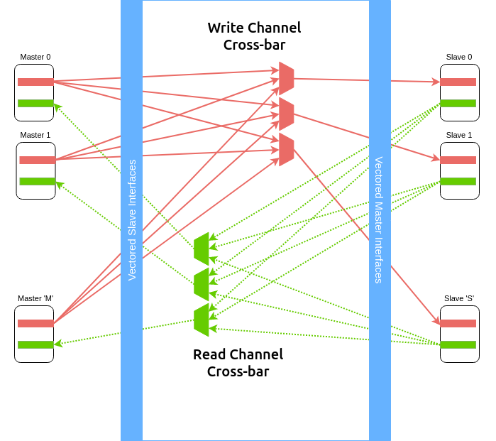

.. _axi4_crossbar:

###########################
AXI4 Cross-bar Interconnect
###########################

The AXI4 Cross-bar interconnect is used to connect one or more AXI4 compliant master devices
to one or more AXI4 compliant slave devices. In includes the following features:

- ID width can range upto 32-bits
- The address widths can go upto 64-bits.
- The data widths supported are: 32, 64, 128, 256, 512 and 1024.
- Provides a configurable size of user-space on each channel.
- Supports aligned and unaligned transfers.
- Support read-only and write-only master-slave combinations resulting in reduced overheads.
- Static and Round Robin priority arbitration

**AXI4 Interconnect Limitations**

- AXI4 Quality of Service (QoS) signals do not influence arbitration priority within the crossbar
  and the signals are simply propagated without any manipulation from master to slaves.
- The cross bar will not time-out if any destination of the cross-bar stalls indefinitely.
- Low power interface features are not currently supported.
- ID based re-ordering is not supported.

From henceforth, ``M`` would represent the number of masters connected to the
cross-bar and ``S`` would represent the number of slaves connected to the
cross-bar.

.. _axi4_parameters:

Parameters
==========

Each instance of the cross-bar consists of vectored AXI4 slave signals which should be
connected to either master-transactors or directly to a master interface and
vectored AXI4 master signals which should be connected to either slave-transactors or
directly to a slave interface.

The cross-bar interfaces are parameterized with the following parameters:

.. tabularcolumns:: |l|L|

.. _axi4_crossbar_params:

.. table:: AXI4 Cross-bar Interface Parameters

  ==================  ===========
  Parameter Name      Description
  ------------------  -----------
  ``wd_id``           size of the id fields in all the channels.
  ``wd_addr``         size of the address fields in the read-address and write-address channels
  ``wd_data``         size of the data fields in the read-response and write-data channels
  ``wd_user``         size of the user fields in all the channels.
  ``tn_num_masters``  indicates the number of masters that will be connected to
                      this fabric.
  ``tn_num_slaves``   indicates the number of slaves that will be connected to
                      this fabric.
  ==================  ===========

While the above parameters control the interface signals of the cross-bar, the
following need to be provided to the module instance to control the arbitration
and connection:

.. tabularcolumns:: |l|L|

.. table:: AXI4 Cross-bar Module Arguments

  ===================== =============================================================================
  Parameter Name        Description
  --------------------- -----------------------------------------------------------------------------
  ``fn_rd_memory_map``  A function which provides a memory map of the address-space. It
                        takes an address as an argument and returns a slave-number. This function is
                        used by the read channels.
  ``fn_wr_memory_map``  A function which provides a memory map of the address-space. It
                        takes an address as an argument and returns a slave-number. This function is
                        used by the write channels.
  ``read_slave``        An ``S`` sized mask vector indicating if a particular slave has read support
                        or not
  ``write_slave``       An ``S`` sized mask vector indicating if a particular slave has write support
                        or not
  ``fixed_priority_rd`` An ``M`` sized vector which indicates if the respective master has fixed
                        priority of participates in round-robin arbitration on the read channel. 
                        Setting a bit to 1 indicates the master as fixed priority, while setting it 
                        to 0 would mean it participates in round-robin arbitration with other masters 
                        who has their bits set to 0.
  ``fixed_priority_wr`` An ``M`` sized vector which indicates if the respective master has fixed
                        priority of participates in round-robin arbitration on the write channel. 
                        Setting a bit to 1 indicates the master as fixed priority, while setting it 
                        to 0 would mean it participates in round-robin arbitration with other masters 
                        who has their bits set to 0.
  ===================== =============================================================================

.. note:: By using the above two functions, one can generate an area optimized cross-bar for a given SoC 
  which may contain read-only and write-only slaves.

.. note:: It is recommended to keep the masters participating in round-robin to be contiguous
   (either at the LSBs or the MSBs) for consistent fairness. More details on arbitration policy are
   available in :ref:`arbitration_axi4`

Micro-Architecture
==================

.. _axi4_crossbar_img:

   Crossbar Data Paths for Read and Write Channels

The cross-bar internally instantiates ``M`` slave transactors and the ``S``
master transactors. The slave transactors recieve signals from the ``M`` masters
connected to the cross-bar, while the master transactors recieve signals from
the ``S`` slaves connected to the cross-bar.

As shown in :numref:`axi4_crossbar_img` the arbitration logic for the read and write channels are
maintained separately to enable maximum parallelism. The cross bar also
implements two ``M`` x ``S`` matrices which keep track of the transaction
originated between masters and slaves and thus guide in routing the responses
from the slaves to the masters. 
Each element in the above connection matrices is an 8 entry fifo structure,
thereby allowing to queue upto 8 unique requests between the master-slave
combination.

The cross-bar implements parallel read and write data paths connecting each
slave interface to all master interfaces it can access based on the memory map
functions provided. At any point multiple transactions from different sources to
different destinations can occur within the cross-bar. 

For the write-data channel, the source-destination combination is locked by the
write-address channel either in the same cycle or the previous cycle.

.. _arbitration_axi4:

Arbitration Policy
------------------

By default, the arbitration is granted based on the relative priority of the associated masters
connected to the vectored slave interace. A master connected to a lower slot number on the vectored
interface has higher priority over a master connected to a higher slot number.

However, during instantiation one can choose which masters should participate in a round-robin
arbitration scheme for read and write channels by using the parameters mentioned in
:numref:`axi4_crossbar_params`. 

.. _address_decode_axi4:

Address Decode
--------------

The cross-bar module requires two functions (``fn_rd_memory_map`` and
``fn_wr_memory_map``) to be
provided as an input which is used by the read and write channels to
identify a correct-slave. The function should take as input an address of the
same width : ``wd_addr`` and return a slave-number which indicates which one of
the vectored slave interfaces has been selected for this transaction. 

Disjoint address spaces selecting the same slave are also allowed. The
distinction between these address spaces is the responsibility of the slave
device.

If a device is read-only or write-only then its memory map allocation can be skipped
from the ``fn_rd_memory_map`` or ``fn_wr_memory_map`` functions respectively to remove the
corresponding channel connections.

Error signaling
---------------

The cross-bar does not internally generate the DECERR, it expected that one of
the ``S`` slaves is an **Error Slave** which is selected for all holes within
the address maps (applies to both read and write channels) and responds with a DECERR.

Using the Cross-bar IP
======================

The IP is designed in BSV and available at: https://gitlab.com/incoresemi/blocks/fabrics
The following steps demonstrate on how to configure and generate verilog RTL of
the cross-bar IP. 

.. note:: The user is expected to have the downloaded and installed 
  open-source bluespec compiler available at: https://github.com/BSVLang/Main

Configuration and Generation
----------------------------

1. **Setup**:

   The IP uses the python based `cogapp tool <https://nedbatchelder.com/code/cog/>`_ to generate bsv files with cofigured instances. 
   Steps to install the required tools to generate the configured IP in verilog RTL can be found 
   in `Appendix <appendix.html>`_. Python virtual environment needs to be activated before 
   proceeding to the following steps.

2. **Clone the repo**:

   .. code:: bash
   
      git clone https://gitlab.com/incoresemi/blocks/fabrics.git
      ./manager.sh update_deps
      cd axi4/test

3. **Configure Design**: 
   
   The yaml file: ``axi4_crossbar_config.yaml`` 
   is used for configuring the crossbar. Please refer to :numref:`axi4_crossbar_params` 
   for information on the parameters used in the yaml file. 
   
   Address map should also be specified in this file using the slot-number 
   as the key of the dictionary. Following rules apply to the memory map:

     1. slot-numbering should be from 0 to ``tn_num_slaves - 1``
     2. Each slave can have one of the following access policies: ``read-only``, ``write-only``, 
        ``read-write`` and ``error``. An ``error`` slave need not have the ``base`` and ``bound``
        fields specified.
     3. Atleast one of the slaves should have access as ``error``

4. **Generate Verilog**: use the following command with required settings to
   generate verilog for synthesis/simulation:

   .. code:: bash

     make TOP_FILE=axi4_crossbar.bsv TOP_MODULE=mkaxi4_crossbar generate_instances
   
   The generated verilog file is available in: ``build/hw/verilog/mkaxi4_crossbar.v``

5. **Interface signals**: in the generated verilog, the vectored slave interface
   signals (to which masters will be connected to) are prefixed with
   ``frm_master_<num>``. The vectored master interface signals (to which slaves
   will be connected to) are prefixed with ``to_slaves_<num>``. Since the IP is a
   synchronous IP, the same clock and reset (active-low) signals (``ACLK`` and ``ARESETN``) are used by 
   all channles across all devices.

6. **Simulation**: The top module for simulation is ``mkaxi4_crossbar``. Please follow the steps
   mentioned in :numref:`verilog_sim_env` when compiling the top-module for simulation

Verilog Signals
---------------

:numref:`verilog_names_axi4` describes the signals in the generated verilog for the following configuration 

.. code:: yaml

    wd_id: 4
    wd_addr: 32
    wd_data: 64
    wd_user: 0
    tn_num_masters: 1
    tn_num_slaves:  1
    fixed_priority_rd: 0b1
    fixed_priority_wr: 0b1
    memory_map:
      0:
        access: error

.. _verilog_names_axi4:

.. table:: AXI4 cross-bar interface signals in from verilog

  ==============================  =========  ==========  ======================== 
  Signal Names                    Direction  Size(Bits)  Description          
  ------------------------------  ---------  ----------  ------------------------ 
  ACLK                            Input      1           clock for all channels 
  ARESETN                         Input      1           an active low reset    
  frm\_master\_0\_AWREADY         Output     1           signal sent to master
  frm\_master\_0\_WREADY          Output     1           signal sent to master
  frm\_master\_0\_BVALID          Output     1           signal sent to master
  frm\_master\_0\_BID             Output     4           signal sent to master
  frm\_master\_0\_BRESP           Output     2           signal sent to master
  frm\_master\_0\_ARREADY         Output     1           signal sent to master
  frm\_master\_0\_RVALID          Output     1           signal sent to master
  frm\_master\_0\_RID             Output     4           signal sent to master
  frm\_master\_0\_RDATA           Output     64          signal sent to master
  frm\_master\_0\_RRESP           Output     2           signal sent to master
  frm\_master\_0\_RLAST           Output     1           signal sent to master
  to\_slave\_0\_AWVALID           Output     1           signal sent to slave 
  to\_slave\_0\_AWID              Output     4           signal sent to slave 
  to\_slave\_0\_AWADDR            Output     32          signal sent to slave 
  to\_slave\_0\_AWLEN             Output     8           signal sent to slave 
  to\_slave\_0\_AWSIZE            Output     3           signal sent to slave 
  to\_slave\_0\_AWBURST           Output     2           signal sent to slave 
  to\_slave\_0\_AWLOCK            Output     1           signal sent to slave 
  to\_slave\_0\_AWCACHE           Output     4           signal sent to slave 
  to\_slave\_0\_AWPROT            Output     3           signal sent to slave 
  to\_slave\_0\_AWQOS             Output     4           signal sent to slave 
  to\_slave\_0\_AWREGION          Output     4           signal sent to slave 
  to\_slave\_0\_WVALID            Output     1           signal sent to slave 
  to\_slave\_0\_WDATA             Output     64          signal sent to slave 
  to\_slave\_0\_WSTRB             Output     8           signal sent to slave 
  to\_slave\_0\_WLAST             Output     1           signal sent to slave 
  to\_slave\_0\_BREADY            Output     1           signal sent to slave 
  to\_slave\_0\_ARVALID           Output     1           signal sent to slave 
  to\_slave\_0\_ARID              Output     4           signal sent to slave 
  to\_slave\_0\_ARADDR            Output     32          signal sent to slave 
  to\_slave\_0\_ARLEN             Output     8           signal sent to slave 
  to\_slave\_0\_ARSIZE            Output     3           signal sent to slave 
  to\_slave\_0\_ARBURST           Output     2           signal sent to slave 
  to\_slave\_0\_ARLOCK            Output     1           signal sent to slave 
  to\_slave\_0\_ARCACHE           Output     4           signal sent to slave 
  to\_slave\_0\_ARPROT            Output     3           signal sent to slave 
  to\_slave\_0\_ARQOS             Output     4           signal sent to slave 
  to\_slave\_0\_ARREGION          Output     4           signal sent to slave 
  to\_slave\_0\_RREADY            Output     1           signal sent to slave 
  frm\_master\_0\_AWVALID         Input      1           signal driven by master
  frm\_master\_0\_AWID            Input      4           signal driven by master
  frm\_master\_0\_AWADDR          Input      32          signal driven by master
  frm\_master\_0\_AWLEN           Input      8           signal driven by master
  frm\_master\_0\_AWSIZE          Input      3           signal driven by master
  frm\_master\_0\_AWBURST         Input      2           signal driven by master
  frm\_master\_0\_AWLOCK          Input      1           signal driven by master
  frm\_master\_0\_AWCACHE         Input      4           signal driven by master
  frm\_master\_0\_AWPROT          Input      3           signal driven by master
  frm\_master\_0\_AWQOS           Input      4           signal driven by master
  frm\_master\_0\_AWREGION        Input      4           signal driven by master
  frm\_master\_0\_WVALID          Input      1           signal driven by master
  frm\_master\_0\_WDATA           Input      64          signal driven by master
  frm\_master\_0\_WSTRB           Input      8           signal driven by master
  frm\_master\_0\_WLAST           Input      1           signal driven by master
  frm\_master\_0\_BREADY          Input      1           signal driven by master
  frm\_master\_0\_ARVALID         Input      1           signal driven by master
  frm\_master\_0\_ARID            Input      4           signal driven by master
  frm\_master\_0\_ARADDR          Input      32          signal driven by master
  frm\_master\_0\_ARLEN           Input      8           signal driven by master
  frm\_master\_0\_ARSIZE          Input      3           signal driven by master
  frm\_master\_0\_ARBURST         Input      2           signal driven by master
  frm\_master\_0\_ARLOCK          Input      1           signal driven by master
  frm\_master\_0\_ARCACHE         Input      4           signal driven by master
  frm\_master\_0\_ARPROT          Input      3           signal driven by master
  frm\_master\_0\_ARQOS           Input      4           signal driven by master
  frm\_master\_0\_ARREGION        Input      4           signal driven by master
  frm\_master\_0\_RREADY          Input      1           signal driven by master
  to\_slave\_0\_AWREADY           Input      1           signal driven by slave 
  to\_slave\_0\_WREADY            Input      1           signal driven by slave 
  to\_slave\_0\_BVALID            Input      1           signal driven by slave 
  to\_slave\_0\_BID               Input      4           signal driven by slave 
  to\_slave\_0\_BRESP             Input      2           signal driven by slave 
  to\_slave\_0\_ARREADY           Input      1           signal driven by slave 
  to\_slave\_0\_RVALID            Input      1           signal driven by slave 
  to\_slave\_0\_RID               Input      4           signal driven by slave 
  to\_slave\_0\_RDATA             Input      64          signal driven by slave 
  to\_slave\_0\_RRESP             Input      2           signal driven by slave 
  to\_slave\_0\_RLAST             Input      1           signal driven by slave 
  ==============================  =========  ==========  ======================== 

