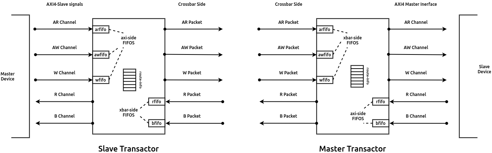
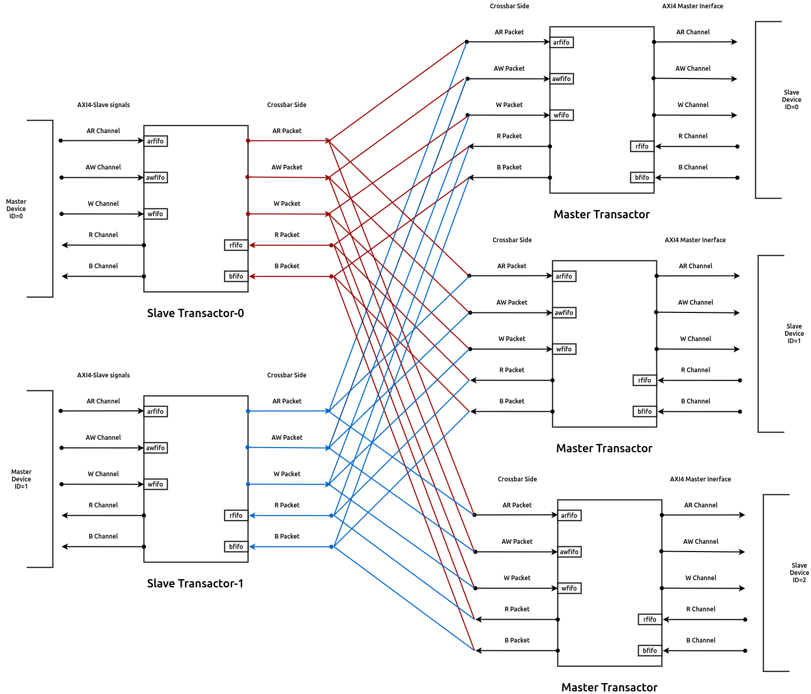

.. _axi4l_crossbar:

################################
AXI4-Lite Cross-bar Interconnect
################################

The AXI4-Lite Cross-bar interconnect is used to connect one or more AXI4-Lite compliant master devices
to one or more AXI4-Lite compliant slave devices. In includes the following features:

- The address widths can go upto 64-bits.
- The data widths supported are: 32, 64, 128, 256, 512 and 1024.
- Provides a configurable size of user-space on each channel.
- Supports aligned and unaligned transfers.
- Support read-only and write-only master-slave combinations resulting in reduced overheads.
- Static and Round Robin priority arbitration

From henceforth, ``M`` would represent the number of masters connected to the
cross-bar and ``S`` would represent the number of slaves connected to the
cross-bar.

.. _axi4l_parameters:

Parameters
==========

Each instance of the cross-bar consists of vectored AXI4-Lite slave signals which are
connected to either master-transactors or directly to a master interface and
vectored AXI4-Lite master signals which are connected to either slave-transactors or
directly to a slave interface.

The cross-bar interfaces are parameterized with the following parameters:

.. _axi4l-crossbar-params:

.. tabularcolumns:: |l|L|

.. table:: AXI4-Lite Cross-bar Interface Parameters

  ==================  ===========
  Parameter Name      Description
  ------------------  -----------
  ``wd_addr``         size of the address fields in the read-address and write-address channels
  ``wd_data``         size of the data fields in the read-response and write-data channels
  ``wd_user``         size of the user fields in all the channels.
  ``tn_num_masters``  indicates the number of masters that will be connected to
                      this fabric.
  ``tn_num_slaves``   indicates the number of slaves that will be connected to
                      this fabric.
  ==================  ===========

While the above parameters control the interface signals of the cross-bar, the
following need to be provided to the module instance to control the arbitration
and connection:

.. tabularcolumns:: |l|L|

.. table:: AXI4-Lite Cross-bar Module Arguments

  ===================== =============================================================================
  Parameter Name        Description
  --------------------- -----------------------------------------------------------------------------
  ``fn_rd_memory_map``  A function which provides a memory map of the address-space. It
                        takes an address as an argument and returns a slave-number. This function is
                        used by the read channels.
  ``fn_wr_memory_map``  A function which provides a memory map of the address-space. It
                        takes an address as an argument and returns a slave-number. This function is
                        used by the write channels.
  ``read_slave``        An ``S`` sized mask vector indicating if a particular slave has read support
                        or not
  ``write_slave``       An ``S`` sized mask vector indicating if a particular slave has write support
                        or not
  ``fixed_priority_rd`` An ``M`` sized vector which indicates if the respective master has fixed
                        priority of participates in round-robin arbitration on the read channel. 
                        Setting a bit to 1 indicates the master as fixed priority, while setting it 
                        to 0 would mean it participates in round-robin arbitration with other masters 
                        who has their bits set to 0.
  ``fixed_priority_wr`` An ``M`` sized vector which indicates if the respective master has fixed
                        priority of participates in round-robin arbitration on the write channel. 
                        Setting a bit to 1 indicates the master as fixed priority, while setting it 
                        to 0 would mean it participates in round-robin arbitration with other masters 
                        who has their bits set to 0.
  ===================== =============================================================================

.. note:: By using the above two functions, one can generate an area optimized cross-bar for a given SoC 
  which may contain read-only and write-only slaves.

.. note:: It is recommended to keep the masters participating in round-robin to be contiguous
   (either at the LSBs or the MSBs) for consistent fairness. More details on arbitration policy are
   available in :ref:`arbitration_axi4l`

Theory of Operation
===================

Following is the convention/glossary of terms that are used in the following sections:

  * **AR Channel**: refers to the read address channel of the AXI4-Lite protocol
  * **AW Channel**: refers to the write address channel of the AXI4-Lite protocol
  * **W  Channel**: refers to the write data channel of the AXI4-Lite protocol
  * **R  Channel**: refers to the read data channel of the AXI4-Lite protocol
  * **B  Channel**: refers to the write response channel of the AXI4-Lite protocol

.. _axi4lxbar_masterslave_ids:

Master/Slave IDs
----------------

The implementation assigns unique ids to each master and slave device based on the port to which the
master/slave device is connected to, which are used for routing purposes and not visible at the IOs.

.. _axi4lxbar_transactors:

Transactors
-----------

.. _axi4lxbar_img_transactors:

   Master and Slave Transactors used within the AXI4-Lite Crossbar

The cross-bar internally instantiates ``M`` slave transactors and ``S``
master transactors. These transactors provide an AXI4-Lite interface on one side (driving the external
signals of the cross-bar) and a FIFO like interface on the other side. 
The ``M`` slave transactors provide an AXI4-Lite
slave interface externally which are to be connected to ``M`` master devices like DMA masters, cache
masters, etc. The ``S`` master transactors provide an AXI4-Lite master interface externally, which are to
be connected to slave devices like, UART, SPI, Memory controllers, etc. 

Each of these transactors internally include a two entry FIFO on each of the five AXI4-Lite
channels. For the slave transactors, the FIFOs on the *AW*, *W* and *AR* 
channels are enqueued when the corresponding master devices drive valid transactions on these
channels. We will refer to these set of FIFOs as **axi-side** FIFOs.
The FIFOs on the *R* and *B* channels are enqued by logic within the
interconnect and will be refered to as **xbar-side** FIFOs. The axi-side and xbar-side fifos 
for a master transactor are interchanged as compared to the slave transactor. 
:numref:`axi4lxbar_img_transactors` shows the interface signals and the placement of these FIFOs for the 
master and slave trasactors.

When a master device initiates a new trasaction on the *AR*, *AW* or *W* channels the corresponding axi-side
FIFOs hold a valid entry for routing within the crossbar interconnect in the immediate cycle. 
Similarly, when the  crossbar routes an *R* or *B* packet to the corresponding xbar-side FIFOs of the
transactor, the master device will see these transactions in the immediate cycle.
:numref:`axi4lxbar_rd_addr_wave` shows the behavior in case of the *AR* channel being driven by a master device,
and the corresponding axi-side FIFO in the connected slave transactor. 

.. _axi4lxbar_rd_addr_wave:

.. wavedrom::
  :align: center
  :caption: Bevahvior of FIFO on the read-address channel of the slave transactor

  {"signal": [
    {"name": "CLK", "wave": "P....."},
    {"name": "ARVALID", "wave": "0.1.0."},
    {"name": "ARADDR",  "wave": "x.==x.", "data": ["A1", "A2"] },
    {"name": "ARREADY",  "wave": "1...0."},
    {"name": ".."},
    {"name": ".."},
    {"name": "s-ar-fifo.notEmpty", "wave": "0..1.."},
    {"name": "s-ar-fifo.notFull",  "wave": "1...0."}
  ]}

Rest of the FIFOs in the slave transactor work analogously to the above behavior. 
The next section will discuss how transactions received on the axi-side FIFOs are
routed to their destination through the crossbar.

.. _axi4lxbar_routing_transactions:

Transaction Routing
-------------------

.. _axi4lxbar_img_crossbar:

   Crossbar interconnect with transactors and master/slave devices

Once the transactions from the master/slave devices are latched into the corresponding axi-side
FIFOs, they need to be routed through the crossbar to their target nodes. It should be noted here
that the routing logic for the read bus (comprising of the *AR* and *R* channels/packets) is separate
from the routing logic for the write bus (comprising of the *AW*, *W* and *B* channels/packets) to
leverage maximum performance. The next paragraphs will discuss the routing for read and write
transactions

Read Transactions:
  Once the *arfifo* in the slave transactors have a valid entry, the target master transactor to which
  this transaction needs to be routed is deduced using the ``fn_rd_memory_map`` function provided to
  the design at compile time. However, the salve transactor can only carry out the transfer to the
  master transactor, if the *arfifo* in the master transactor has atleast one empty slot. 
  
  It is possible that the slave device connected to the master transactor is busy has not been able
  to service the pending request(s) that are present in *arfifo* thereby causing it to become full in
  due course of time.
  In such a scenario, a new request from a slave
  transactor can no longer be enqued and thus creates a stall. The slave transactor continues the
  attempt to make the transfer again in the sub-sequent cycles until success.

  .. note:: Transactions sitting in any of the fifos in the transactors, like the case above, can be
     defined as in-flight transactions, which have been received by the master/slave device but have
     not yet reached the target slave/master device.

  To keep track of the pending transactions generated by a slave transactor and where the response
  of master transactor should be routed to, the crossbar maintains a series of **route-info** FIFOs
  in the slave and master transactors. For the read transactions, each slave and master transactor
  include an 8-entry route-info FIFO to store the master and slave ids participating in a
  transaction. In a slave transactor, this FIFO indicates which slave-device's (master transactor) 
  response is expected to be routed to the connected master-device. Similarly, the route-info FIFO
  in a master transactor indicates the ID of the master-device (slave transactor) to whom the
  response is to be routed to. 

  .. note:: This implementation has a limitation of not supporting interleaving and data reordering,
     and thus slave-devices connected to this crossbar cannot have a re-ordering depth of more than
     1. i.e. all responses from the particular slave device have to be in the same order of 
     the requests presented at its port.

  These route-info FIFOs are enqueued with the master/slave IDs when a valid transfer between a
  slave transactor ar-fifo and master transactor ar-fifo occurs. 

  Once the master transactor sends an *RLAST* signal on the *R* packet, the corresponding route-info
  FIFOs are popped (dequeued) allowing the slave/master to serve the next pending transaction in
  order.

  :numref:`axi4lxbar_rd_routing` shows the above behavior of the read transaction routing happening
  between a master device with ID M1 and a slave device with ID S1.

  .. _axi4lxbar_rd_routing:
  
  .. wavedrom::
    :align: center
    :caption: Read transaction routing through the crossbar.
  
    {"signal": [
        {"name": "CLK",     				  "wave": "P......"},
      [ "Master Device",
        {"name": "M-ARADDR",  				"wave": "x.=x...", "data": ["A1", "A2"] },
        {"name": "M-ARVALID", 				"wave": "0.10..."}
      ],
      	{},
      ["Slave Transactor",
      	{"name": "s-ar-fifo.enq",			"wave": "0.10..."},
      	{"name": "s-ar-fifo.deq",			"wave": "0..10.."},
        {"name": "s-ar-fifo.notEmpty","wave": "0..10.."},
       	{"name": "s-route-info",			"wave": "x...=x.", "data": ["S1", "A2"] }
      ],
      	{},
      ["Master Transactor",
      	{"name": "m-ar-fifo.enq",			"wave": "0..10.."},
      	{"name": "m-ar-fifo.deq",			"wave": "0...10."},
        {"name": "m-ar-fifo.notEmpty","wave": "0...10."},
       	{"name": "m-route-info",			"wave": "x...=x.", "data": ["M1", "A2"] }
      ],
        {},
      ["Slave Device",
    
        {"name": "S-ARADDR",  				"wave": "x...=x.", "data": ["A1", "A2"] },
        {"name": "S-ARVALID", 				"wave": "0...10."}
      ],
      {}
    ],
      
      "head":{"tick":0}
    }

Write Transactions:
  The working of the write transactions is very similar to that of the read transactions, except for the
  change that an extra set of route-info FIFOs are maintained on each master and slave transactor
  for the *W* channel as well. Thus each transactor maintains a
  route-info FIFO for the *AW* channel and another route-info for the *W* channel. 

  Therefore, when a valid transfer occurs between the aw-fifo of
  the slave transactor and the aw-fifo of the master transactor, the *AW* and *W* channel route-info
  FIFOs of both the transactors are updated. Ths *W* channel route-info FIFOs, ensure that the
  sub-sequent beats of the transaction from the slave transactor are routed to the correct master
  transactor.

  The route-info FIFOs are popped/dequeued when the write response of the *B* channel is received.
  :numref:`axi4lxbar_wr_routing` shows the behavior of the write transactions through the crossbar.

  .. _axi4lxbar_wr_routing:
  
  .. wavedrom::
    :align: center
    :caption: Write transaction routing through the crossbar.
    :height: 700px
  
    {"signal": [
        {"name": "CLK",     				  "wave": "P......"},
      [ "Master Device",
        {"name": "M-AWADDR",  				"wave": "x.=x...", "data": ["A1", "A2"] },
        {"name": "M-AWVALID", 				"wave": "0.10..."},
        {"name": "M-WDATA",    				"wave": "x.=x...", "data": ["D1", "A2"] },
        {"name": "M-WVALID", 	  			"wave": "0.10..."}
      ],
      	{},
      ["Slave Transactor",
      	{"name": "s-aw-fifo.enq",			"wave": "0.10..."},
      	{"name": "s-aw-fifo.deq",			"wave": "0..10.."},
        {"name": "s-aw-fifo.notEmpty","wave": "0..10.."},
      	{"name": "s-w-fifo.enq",			"wave": "0.10..."},
      	{"name": "s-w-fifo.deq",			"wave": "0..10.."},
        {"name": "s-w-fifo.notEmpty", "wave": "0..10.."},
       	{"name": "s-route-info-aw",  	"wave": "x...=x.", "data": ["S1", "A2"] },
       	{"name": "s-route-info-w",  	"wave": "x...=x.", "data": ["S1", "A2"] }
      ],
      	{},
      ["Master Transactor",
      	{"name": "m-aw-fifo.enq",			"wave": "0..10.."},
      	{"name": "m-aw-fifo.deq",			"wave": "0...10."},
        {"name": "m-aw-fifo.notEmpty","wave": "0...10."},
      	{"name": "m-w-fifo.enq",			"wave": "0..10.."},
      	{"name": "m-w-fifo.deq",			"wave": "0...10."},
        {"name": "m-w-fifo.notEmpty", "wave": "0...10."},
       	{"name": "m-route-info-aw",		"wave": "x...=x.", "data": ["M1", "A2"] },
       	{"name": "m-route-info-w",		"wave": "x...=x.", "data": ["M1", "A2"] }
      ],
        {},
      ["Slave Device",
    
        {"name": "S-AWADDR",  				"wave": "x...=x.", "data": ["A1", "A2"] },
        {"name": "S-AWVALID", 				"wave": "0...10."},
        {"name": "S-WDATA",    				"wave": "x...=x.", "data": ["D1", "A2"] },
        {"name": "S-WVALID", 		  		"wave": "0...10."}
      ],
      {}
    ],
      
      "head":{"tick":0}
    }

.. _arbitration_axi4l:

Arbitration Policy
------------------

When multiple slave transactors select the same master-transactor to perform a similar type of
(read/write) transaction, arbitration is required to choose which slave transactor will succeed.
The implementation supports two types of arbitration policy: fixed and round-robin. At design time,
the user needs to define which slave-transactors will participate in fixed arbitration and which will
participate in round-robin arbitration using the ``fixed_priority_*`` parameters defined in
:numref:`axi4lxbar_table_modargs`. 

.. note:: Since the read and write channels operate independently, it
  is possible to have the read port of a master-device to have a fixed priority while the write port
  can participate in round-robin arbitration or vice-versa.

Fixed Priority Arbitration:
  By default, the arbitration is granted based on the relative priority of the associated IDs of the
  slave transactors (refer to :numref:`axi4lxbar_masterslave_ids` for more details on how IDs are
  assigned). A slave transactor with a lower ID has higher priority over a slave transactor with a
  higher ID. 

Round-Robin Arbitration:
  For round robin arbitration, the design maintains separate *select* registers for read and write port
  arbitration, whose reset value is 0. The select register indicates the threshold ID value. 
  When a contention occurs, the participating slave transactor whose ID is
  immediately above the select register wins the arbitration. Once a slave transactor is chosen, the
  select register is updated by a value one greater than the ID of the winning transactor. In case
  the winning ID is the highest then the value assigned it 0.

  It is possible, that any point there is a contention amongst slave transactors with fixed
  arbitration and slave transactors configured for round-robin arbitration. In such a case, 
  the slave transactor with fixed arbitration having an ID lower than the ID of the slave
  transactor winning the round-robin arbitration is given access to the master transactor. If all the slave
  transactors with fixed arbitration have an ID higer than the slave transactor winning the
  round-robin arbitration, then the latter is given access to the master transactor.

  :numref:`axi4lxbar_rr_arbitration` Shows how round robin arbitration would work for a crossbar
  consisting of 2 slave transactors with a select threshold of 1.

.. _axi4lxbar_rr_arbitration:

.. wavedrom::
  :caption: Round Robin arbitration amongst 2 masters
  :align: center

  {"signal": [
      {"name": "CLK",     				"wave": "P......."},
    	{"name": "RD-SELECT",  				"wave": "=.......", "data": ["1"] },
    ["Master-1",
    	{"name": "M1-ARADDR",  				"wave": "x.=x....", "data": ["A1"] },
      {"name": "M1-ARVALID", 				"wave": "0.10...."}
    ],
     {},
    ["Master-2",
    	{"name": "M2-ARADDR",  				"wave": "x.=x....", "data": ["A2"] },
      {"name": "M2-ARVALID", 				"wave": "0.10...."}
    ],
    	{},
      {},
    ["Slave Xactor-1",
      {"name": "s1-ar-fifo.NotEmpty", 	"wave": "0..1.0.."},
     	{"name": "s1-route-fifo",			"wave": "x....=x.", "data": ["S1"] }
    ],
     {},
     {},
    ["Slave Xactor-2",
      {"name": "s2-ar-fifo.NotEmpty", 	"wave": "0..10..."},
     	{"name": "s2-route-fifo",			"wave": "x...=x..", "data": ["S1"] }
    ],
     {},
     {},
    ["Master Xactor",
      {"name": "m-ar-fifo.NotEmpty", 		"wave": "0...1.0."},
     	{"name": "m-route-fifo",			"wave": "x...==x.", "data": ["M2", "M1"] }
    ],
      {},
      {},
    ["Slave Device",
  
      {"name": "S-ARADDR",  				"wave": "x...==x.", "data": ["A2", "A1"] },
      {"name": "S-ARVALID", 				"wave": "0...1.0."}
    ],
      {}
  ],
    
    "head":{"tick":0}
  }

.. _address_decode_axi4l:

Address Decode
--------------

The cross-bar module requires two functions (``fn_rd_memory_map`` and
``fn_wr_memory_map``) to be
provided as an input which is used by the read and write channels to
identify a correct-slave. The function should take as input an address of the
same width : ``wd_addr`` and return a slave-number which indicates which one of
the vectored slave interfaces has been selected for this transaction. 

Disjoint address spaces selecting the same slave are also allowed. The
distinction between these address spaces is the responsibility of the slave
device.

If a device is read-only or write-only then its memory map allocation can be skipped
from the ``fn_rd_memory_map`` or ``fn_wr_memory_map`` functions respectively to remove the
corresponding channel connections.

Error signaling
---------------

The cross-bar does not internally generate the DECERR, it expected that one of
the ``S`` slaves is an **Error Slave** which is selected for all holes within
the address maps (applies to both read and write channels) and responds with a DECERR.

Using the Cross-bar IP
======================

The IP is designed in BSV and available at: https://gitlab.com/incoresemi/blocks/fabrics
The following steps demonstrate on how to configure and generate verilog RTL of
the cross-bar IP. 

.. note:: The user is expected to have the downloaded and installed 
  open-source bluespec compiler available at: https://github.com/BSVLang/Main

Configuration and Generation
----------------------------

1. **Setup**:

   The IP uses the python based `cogapp tool <https://nedbatchelder.com/code/cog/>`_ to generate bsv files with cofigured instances. 
   Steps to install the required tools to generate the configured IP in verilog RTL can be found 
   in `Appendix <appendix.html>`_. Python virtual environment needs to be activated before 
   proceeding to the following steps.

2. **Clone the repo**:

   .. code:: bash
   
      git clone https://gitlab.com/incoresemi/blocks/fabrics.git
      ./manager.sh update_deps
      cd axi4/test

3. **Configure Design**: 
   
   The yaml file: ``axi4l_crossbar_config.yaml`` 
   is used for configuring the crossbar. Please refer to :numref:`axi4_crossbar_params` 
   for information on the parameters used in the yaml file. 
   
   Address map should also be specified in this file using the slot-number 
   as the key of the dictionary. Following rules apply to the memory map:

     1. slot-numbering should be from 0 to ``tn_num_slaves - 1``
     2. Each slave can have one of the following access policies: ``read-only``, ``write-only``, 
        ``read-write`` and ``error``. An ``error`` slave need not have the ``base`` and ``bound``
        fields specified.
     3. Atleast one of the slaves should have access as ``error``
     4. While providing the address based and bounds, remember the base is included and bound is not
        for the device under consideration

4. **Generate Verilog**: use the following command with required settings to
   generate verilog for synthesis/simulation:

   .. code:: bash

     make TOP_FILE=axi4l_crossbar.bsv TOP_MODULE=mkaxi4l_crossbar generate_instances
   
   The generated verilog file is available in: ``build/hw/verilog/mkaxi4l_crossbar.v``

5. **Interface signals**: in the generated verilog, the vectored slave interface
   signals (to which masters will be connected to) are prefixed with
   ``frm_master_<num>``. The vectored master interface signals (to which slaves
   will be connected to) are prefixed with ``to_slaves_<num>``. Since the IP is a
   synchronous IP, the same clock and reset (active-low) signals (``ACLK`` and ``ARESETN``) are used by 
   all channles across all devices.

6. **Simulation**: The top module for simulation is ``mkaxi4l_crossbar``. Please follow the steps
   mentioned in :numref:`verilog_sim_env` when compiling the top-module for simulation

Verilog Signals
---------------

:numref:`verilog_names_axi4l` describes the signals in the generated verilog for the following configuration 

.. code:: yaml

    wd_addr: 32
    wd_data: 64
    wd_user: 0
    tn_num_masters: 1
    tn_num_slaves:  1
    fixed_priority_rd: 0b1
    fixed_priority_wr: 0b1
    memory_map:
      0:
        access: error

.. _verilog_names_axi4l:

.. table:: AXI4-Lite  cross-bar interface signals in from verilog

  ==============================  =========  ==========  ======================== 
  Signal Names                    Direction  Size(Bits)  Description          
  ------------------------------  ---------  ----------  ------------------------ 
  ACLK                            Input      1           clock for all channels 
  ARESETN                         Input      1           an active low reset    
  frm\_master\_0\_AWREADY         Output     1           signal sent to master
  frm\_master\_0\_WREADY          Output     1           signal sent to master
  frm\_master\_0\_BVALID          Output     1           signal sent to master
  frm\_master\_0\_BRESP           Output     2           signal sent to master
  frm\_master\_0\_ARREADY         Output     1           signal sent to master
  frm\_master\_0\_RVALID          Output     1           signal sent to master
  frm\_master\_0\_RDATA           Output     64          signal sent to master
  frm\_master\_0\_RRESP           Output     2           signal sent to master
  to\_slave\_0\_AWVALID           Output     1           signal sent to slave 
  to\_slave\_0\_AWADDR            Output     32          signal sent to slave 
  to\_slave\_0\_AWPROT            Output     3           signal sent to slave 
  to\_slave\_0\_WVALID            Output     1           signal sent to slave 
  to\_slave\_0\_WDATA             Output     64          signal sent to slave 
  to\_slave\_0\_WSTRB             Output     8           signal sent to slave 
  to\_slave\_0\_BREADY            Output     1           signal sent to slave 
  to\_slave\_0\_ARVALID           Output     1           signal sent to slave 
  to\_slave\_0\_ARADDR            Output     32          signal sent to slave 
  to\_slave\_0\_ARPROT            Output     3           signal sent to slave 
  to\_slave\_0\_ARREADY           Output     1           signal sent to slave 
  frm\_master\_0\_AWVALID         Input      1           signal driven by master
  frm\_master\_0\_AWADDR          Input      32          signal driven by master
  frm\_master\_0\_AWPROT          Input      3           signal driven by master
  frm\_master\_0\_WVALID          Input      1           signal driven by master
  frm\_master\_0\_WDATA           Input      64          signal driven by master
  frm\_master\_0\_WSTRB           Input      8           signal driven by master
  frm\_master\_0\_BREADY          Input      1           signal driven by master
  frm\_master\_0\_ARVALID         Input      1           signal driven by master
  frm\_master\_0\_ARADDR          Input      32          signal driven by master
  frm\_master\_0\_ARPROT          Input      3           signal driven by master
  frm\_master\_0\_RREADY          Input      1           signal driven by master
  to\_slave\_0\_AWREADY           Input      1           signal driven by slave 
  to\_slave\_0\_WREADY            Input      1           signal driven by slave 
  to\_slave\_0\_BVALID            Input      1           signal driven by slave 
  to\_slave\_0\_BRESP             Input      2           signal driven by slave 
  to\_slave\_0\_ARREADY           Input      1           signal driven by slave 
  to\_slave\_0\_RVALID            Input      1           signal driven by slave 
  to\_slave\_0\_RDATA             Input      64          signal driven by slave 
  to\_slave\_0\_RRESP             Input      2           signal driven by slave 
  ==============================  =========  ==========  ======================== 

