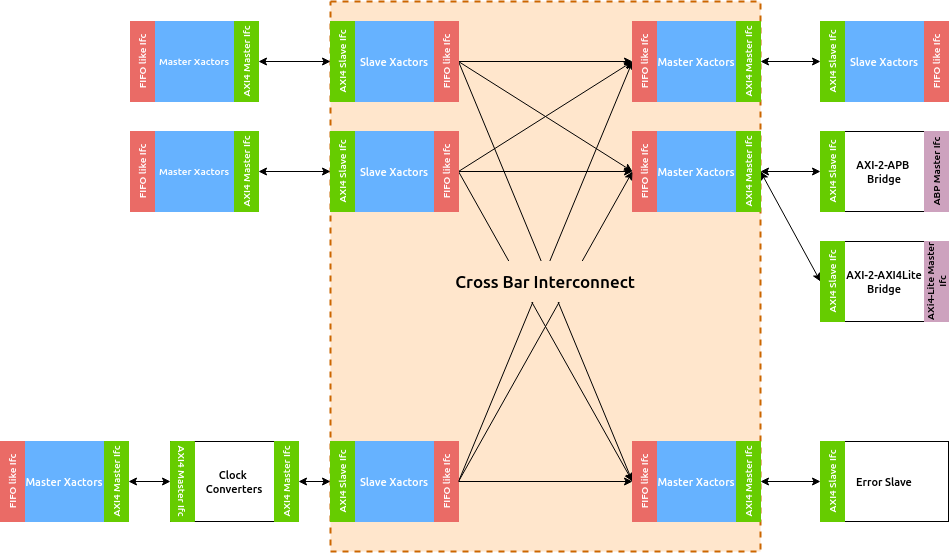

########
Overview
########

.. include:: <isonum.txt>

This document describes the various open-source Interconnect IPs available by InCore
Semiconductors. A majority of the IPs are designed in Bluespec System Verilog (BSV).
Currently only a subset of AMBA |reg| (Advanced Microntroller Bus Architecture) protocol implementations are
available.

The Interconnect IP subsystem comprises of multiple blocks each of which can
be used independently in external designs. The following is an overview of these
components:

1. **AXI4** |trade| **Cross-bar Interconnect** : Connects one or more AXI4 compliant masters to
   one or more memory mapped slaves.
2. **AXI4-Lite** |trade| **Cross-bar Interconnect** : Connects one or more AXI4-Lite compliant masters to
   one or more memory mapped slaves.
3. **APB Interconnect** : Connects one APB compliant master to one or more memory mapped slaves.
4. **Protocol Bridges** : connects AXI4 master to an AXI4-Lite or an APB slave
5. **Buffers**: connects an AXI4/AXI4Lite master to another AXI4/AXI4Lite memory mapped slave
   through a set of pipelined registers, typically used to break a critical path
6. **Error Slave**: A dummy slave to respond with error for every request type.

.. _block-level:

   
   Block level representation of various AXI4 IP components

:numref:`block-level` provides a block level representation of how the above IP
blocks can possibly interact with each other.

